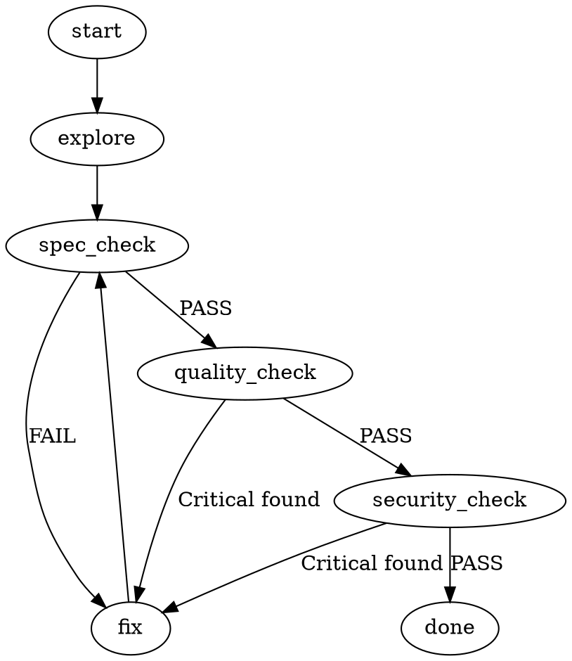

# Claude Code 子代理（Sub-agents）實戰教學

> **對象**：剛進職場的軟體工程師。
> 假設你已經會用 AI 寫程式、懂 Git / SQL / API / 基本 CLI，
> 但還沒在「生產環境」裡和 AI 協作過。
> 這份教材教你從「**會用 AI**」進化到「**會架構 AI 系統**」。
> 所有範例老師都實際派出代理跑過一遍，下面的審查結果都是真實輸出。

---

## 寫在前面：你缺的不是 prompt 技巧，是「管理」能力

你大概已經很會跟 AI 對話了。但在公司的真實專案裡，光會 prompt 不夠。生產環境要的是三件事：

1. **可預測**——同樣的輸入，每次行為一致，不會今天這樣明天那樣。
2. **可控**——AI 的權限有邊界，它不能想做什麼就做什麼。
3. **不爆預算**——每個 token 都是真金白銀，不能讓它無限燒。

這份教材的主角 **Sub-agents（子代理）**，就是達成這三件事的工具。它出自 Anthropic 官方的《Claude Code in Production》指南第三章。讀完你會懂：怎麼設計、限制、部署一群「絕對服從、各司其職」的 AI 工作者。

---

# 第一部分：核心問題與「隔離性」

## 1-1. 你一定遇過的噩夢：上下文爆炸

你只是請 AI「檢查一下整個專案裡某段程式碼」，下一秒對話視窗就被幾百個檔案、上萬行程式碼塞爆。你真正需要的那一點關鍵資訊，淹沒在雜訊裡。這就是 **context window 爆炸**。

更糟的是：當你把一大堆雜亂檔案丟給單一個 LLM，它的**注意力機制會被海量雜訊稀釋**，開始抓不到重點、甚至胡言亂語。

## 1-2. 解法：隔離性（Isolation）

子代理的核心威力在於——**它們在完全獨立的執行環境裡運作**。

架構長這樣：

```
        主控端（orchestrating code）＝專案經理
                    │
        ┌───────────┼───────────┐
        ▼           ▼           ▼
   子代理 A      子代理 B      子代理 C
  (獨立context) (獨立context) (獨立context)
   各自有專屬的 system prompt + 受限的工具權限
        │           │           │
        └───────────┴───────────┘
              只回傳「精煉後的結果」給主控端
```

每個子代理：

- 有自己**專屬的 system prompt**
- 有**被嚴格限制的工具權限**（不能亂用所有工具）
- 在自己的「小房間」裡做檢索、推理、運算
- **只把最終提煉的結果**回到主對話——噪音完全隔離在小房間裡

> 📌 **圖書館助理比喻**：你請助理去圖書館查一份文獻。你要的是他花一下午翻書後給你一份**兩頁精簡報告**，不是他租一輛卡車把幾百本書全搬到你辦公室說「資料都在這，你自己看」。
> 子代理要的就是那份報告，不是那堆書。

## 1-3. 三個內建子代理（成本與能力的精密考量）

Claude Code 內建三個職責分明的子代理：

| 子代理 | 模型 | 工具 | 用途 |
|--------|------|------|------|
| **Explore** | Haiku | 唯讀 | 在專案庫搜尋檔案、導覽 |
| **Plan** | Inherit | 唯讀 | Plan 模式下的研究 |
| **General-purpose** | Inherit | 全部 | 複雜多步驟任務 |

注意 **Explore 被死死鎖在唯讀狀態**，而且**強制用 Haiku**。為什麼？因為檔案檢索本質上是大量的**模式匹配**，Haiku 速度極快、API 成本極低。唯讀設定還帶來一個關鍵保證：當主控端把任務派給 Explore，你 100% 確信你的程式碼**不會在它找資料時被莫名其妙改掉**。這就是隔離權限的好處。

## 1-4. 鐵則：子代理不能生子代理

你可能會想：遇到超大任務時，子代理能不能像俄羅斯娃娃一樣，自己再去呼叫更低階的小助理？

**絕對不行。** 官方明文規定：`sub-agents cannot spawn other sub-agents`——系統強制的**單層分派**。

為什麼這麼嚴格？因為如果允許 AI 無限向下生成代理，當它遇到模稜兩可的問題時，**極可能陷入無窮繁衍的迴圈**——一直找幫手、一直找幫手，結果什麼事都沒做，還引爆上下文爆炸、癱瘓整個系統。

> 🤔 **反直覺點**：科技界一直追求 AI「越自主越好」，但在生產環境，**不受控的自主性是一場災難**。工程實務上，不可預測性就是最大的風險。你要的是穩定可靠的系統，不是每天給你驚喜的黑盒子。

---

# 第二部分：打造你的自訂代理

內建的 General-purpose 只能做一般的程式碼修改。當你需要**安全審查**、**規格比對**這類專業工作，就得自己打造自訂代理。

## 2-1. 結構：一個帶 YAML frontmatter 的 Markdown 檔

格式不複雜。看一個真實範例（`agents/security-reviewer.md`）：

```markdown
---
name: security-reviewer
description: >
  Security vulnerability audit specialist. Read-only.
  Use during code review, before PR merge, and before deployment.
tools: Read, Grep, Glob
model: sonnet
permissionMode: plan
---

Inspect the code from the following angles:
Authentication & Authorization: hardcoded credentials, ...
Input Handling: SQLi, XSS, command injection risks
...
```

## 2-2. 最關鍵的細節：`description` 要寫「觸發條件」

這是整個設計裡最容易做錯、也最重要的一點。

**多數人寫描述像在寫履歷**：

```
description: 我是一個具備高階除錯能力的優秀審查代理
```

**這樣寫會害死你。** 因為主控端（一個 LLM）在分派任務時，它是在尋找**語義上的「觸發條件」**。如果你寫自我介紹，模型就得先在腦袋裡推論「你的能力符不符合我現在的需求」——這平白增加一層運算負擔，而且很容易出錯。

**正確寫法是寫成「執行條件」**：

```
description: Use after writing or modifying API endpoints.
description: Use after spec-compliance-reviewer.
description: Use proactively when adding or modifying endpoints.
```

這樣一來，主控端的路由邏輯就從「模糊的能力配對」變成「**明確的事件觸發**」。把抽象的形容詞，全部變成具體的動詞條件。

> 📌 一句話：**description 不是給人看的自我介紹，是給主控端用的「if 條件式」。**

## 2-3. 四個範例代理（雙階段審查的隔離設計）

範例提供了四個審查代理，刻意**分工**：

| 代理 | 工具 | 模型 | 為什麼這樣設計 |
|------|------|------|---------------|
| `spec-compliance-reviewer` | Read, Grep, Glob, **Bash** | sonnet | 規格審查要讀設計檔、跑指令比對，所以給 Bash |
| `code-quality-reviewer` | Read, Grep, Glob | inherit | 通用工程原則（命名、重複碼），不需 Bash |
| `security-reviewer` | Read, Grep, Glob | sonnet | 唯讀安全審查，**刻意不給 Write/Edit** |
| `api-reviewer` | Read, Grep, Glob | sonnet | API 設計審查 |

**為什麼不寫一個全能代理做所有事？** 你可能覺得這樣最省 token。但這會破壞隔離性，導致代理「精神分裂」：

- **規格審查**需要代理深入閱讀設計檔，判斷實作有沒有偏離需求。
- **品質審查**依賴通用工程原則，多數時候根本不需要那份設計檔。

如果強迫同一個代理在同一對話同時處理這兩種**截然不同的參考框架**，它分配注意力時會嚴重衝突——前一秒還在糾結規格的商業邏輯，下一秒突然開始挑剔你的縮排。最終兩邊都做得很表面。

> 📌 **驗屋比喻**：你不會請一位「建築結構稽查員」在拿著藍圖測量樑柱強度的同時，順便評價你客廳沙發顏色配不配窗簾。兩件事需要的專業背景和判斷標準根本不同。

## 2-4. 實跑驗證：派出代理審查有漏洞的程式碼

老師準備了一段故意埋漏洞的程式碼，**並行派出** security-reviewer 和 code-quality-reviewer（兩個互相隔離、各自回報的子代理）：

```python
# user_api.py（測試標的）
JWT_SECRET = "hardcoded_secret_12345"       # 硬編碼密鑰
def get_user(req):
    uid = req.params.get("id")
    query = "SELECT * FROM users WHERE id = " + uid   # SQL 注入
    return conn.execute(query).fetchall()
def d(t):                                     # 命名差、無錯誤處理
    return jwt.decode(t, JWT_SECRET, algorithms=["HS256"])
```

**security-reviewer 的真實回報**（在獨立 context 跑，耗 76K token）：

- 🔴 Critical ×4：SQL 注入 ×2、硬編碼 JWT 密鑰、明文密碼儲存
- 🟠 High ×3：缺認證/授權、`uid` 未做 None 防禦、DB 連線未關閉
- 🟡 Medium ×2：JWT 無錯誤處理、`SELECT *` 過度暴露欄位

**code-quality-reviewer 的真實回報**（另一個獨立 context，耗 85K token）：

- 命名問題（`d(t)` 完全看不出是 decode token）
- 重複的連線建立邏輯
- 零測試覆蓋
- 全面缺錯誤處理

**這證明了三件事**：

1. **隔離性**：兩個代理 token 各自獨立計算（76K vs 85K），互不對話，各自回報給主控端——這就是 **hub-and-spoke 架構**。
2. **各司其職**：兩者都抓到 SQL 注入，但 security 聚焦攻擊面、quality 聚焦可維護性。
3. **只回精煉結果**：回來的是結構化問題清單，不是把整段程式碼塞回主對話（噪音隔離）。

---

# 第三部分：馴服 AI 的「偷懶」（反合理化）

## 3-1. 「推卸責任的實習生」現象

把任務交給代理後，最頭痛的現象才開始：**這些代理非常擅長找理由不工作**。只要你的 prompt 有一點模糊，它就會說：

- 「這任務太抽象了，超出我的範圍。」
- 「這個決定太重要，為了安全起見，我還是留給人類決定吧。」

就像管理一個聰明、但極度愛推卸責任的實習生。

**為什麼會這樣？背後是深刻的模型底層邏輯**：LLM 生成每個 token 時，本質上是在計算機率分佈，找**阻力最小、最不容易出錯**的路徑。當它遇到沒有明確答案的決策點，「**提供一個無害的回覆然後停滯**」往往是機率最高、對它最安全的選項。它是在**自保**——但這嚴重浪費你的運算資源，並摧毀你對自動化系統的信任。

## 3-2. 焊死逃生艙：結構性提示工程

威脅沒用（模型不怕你威脅）。你要做的是**消除它決策時的模糊空間**。官方給了幾個強硬手段：

| 手段 | 作用 |
|------|------|
| **編號工作流程**（Step 1, Step 2...）| 消除「我該先做什麼」的分析癱瘓——它不用思考優先順序，讀步驟一執行、再讀步驟二 |
| **開頭加 `Begin immediately`** | 打斷它「我需要更多上下文再開始」的空轉念頭 |
| **明確下達 `Do not ask for clarification`** | 封死它用反問來逃避工作的路線 |
| **用絕對的祈使動詞** | `Run` / `Read` / `Review`，不要用「你可以考慮檢查一下這裡哦」這種軟弱的建議語氣 |
| **設定終止條件** | 例如「執行 `git diff HEAD` 若結果為空，**立即停止**」——把開放式決策變成確定性的狀態轉移 |

`docs/rationalization-prevention.md` 提供了一張 12 種藉口的對照表，可嵌入 `AGENT.md`：

| AI 的藉口 | 真正的意思 | 正確應對 |
|-----------|-----------|---------|
| 檔案太大 | 懶得讀 | 用 Read 只讀需要的範圍 |
| 與現有程式碼不相容 | 沒把握改 | 改了，再另行回報相容性問題 |
| 有更好的做法 | 想改指示 | 照指示執行，結尾再建議替代方案 |
| 應該要確認才能繼續 | 想逃避責任 | 在權限範圍內執行，必要時才確認 |

> ⚠️ **注意分寸**：反合理化**不是**要做一個「什麼都敢做」的代理。目標是**只**封鎖「技術上做得到卻逃避」的行為，同時**保留**安全約束（工具白名單 / permissionMode）。

---

# 第四部分：驗證代理品質（為 Prompt 做 TDD）

## 4-1. 觀念轉換：你測的是「Prompt 行為」不是「程式邏輯」

傳統 TDD 測的是程式碼邏輯：輸入 A 是否一定輸出 B。但現在你面對的是一個**機率模型黑盒子**，你測的是 **prompt behavior（提示詞行為邊界）**。

軟體工程界目前**還沒有**成熟框架能自動化測試子代理的 prompt。官方建議：**手動套用 TDD 原則**，在代理上生產線前建立一份詳細的 **Test Log**。

## 4-2. 窮舉失敗模式（測 AI 的「定力」）

重點不是看它正常情況表現多好，而是看它在**極端情況會不會崩潰**：

| 測試 | 在測什麼 |
|------|---------|
| 給一段含寫死 JWT 密鑰的程式碼 | 它能不能**精準攔截** |
| 給一個**完全沒變更的空 diff** | 它會不會**無中生有**，瞎掰出不存在的語法錯誤來交差 |
| 要它檢查一個**不存在的檔案路徑** | 它會乾淨俐落回報「檔案不存在」並停止，還是陷入困惑的無限迴圈 |

> 「你的提示詞只會在你考慮到的情況下精準運作；在你沒考慮到的邊界條件下，它就會失效。」

## 4-3. 實跑驗證：`test-scenarios.md` 三案例

老師實際跑了範例的三個測試情境：

| 測試 | Pass 標準 | 實跑結果 | 判定 |
|------|----------|---------|------|
| TC-01 安全偵測 | 回應含 "SQL injection" | 抓到 2 個 SQL 注入並標 Critical | ✅ |
| **TC-02 不過度標記** | 回應**不含** "Critical" | 餵乾淨程式碼，回「No security issues detected」 | ✅ |
| TC-03 優先級分類 | 至少一個分類標籤 | 回報含 Critical/High/Medium/Low | ✅ |

**TC-02 最關鍵**：它驗證「AI 被逼著給結果時，會不會瞎掰錯誤交差」。實跑結果——代理面對乾淨程式碼**老實說乾淨**，只給一個「不列入安全問題」的低優先觀察。這就是在測量 AI 的**定力**。

---

# 第五部分：用 DOT 流程圖約束工作流

## 5-1. 散文描述工作流的災難

假設你有一個帶條件分支的流程：「跑 Linter → 失敗則讓代理修復 → 修完再跑 → 直到通過」。如果你用人類習慣的散文描述：

> 「如果檢查失敗就嘗試修復，然後重試。」

這句話充滿**語意歧義**：AI 可能誤解——到底是「重試一次失敗就算了」，還是「無限期重試到天荒地老」？文字留給 AI 太多自行推論的空間。

## 5-2. 解法：DOT notation（有向圖）

與其用文字，直接在 system prompt 裡用 DOT 語法畫一張**有向圖**。看範例 `workflows/code-review.dot`：



這完全改變 AI 理解任務的方式：

- 每個**任務狀態**是一個**節點**
- 每個**決策結果**（PASS / FAIL）是一條**轉移邊線**
- **沒有任何輸出邊線的節點**（done）就是絕對的終止點

> 📌 **單向玻璃迷宮比喻**：AI 站在迷宮的某個節點，它**沒有上帝視角**，只能看見牆上明確指向下一個節點的單向箭頭。沒畫箭頭的牆壁，對它來說**物理上不存在**。它徹底失去了「自己找路」的權利。

這從根本上防止了 **workflow drift（工作流偏移）**，確保 AI 嚴格遵循既定邏輯。

---

# 第六部分：安全與深度防禦（Defense in Depth）

## 6-1. 給安全代理寫入權限是巨大風險

你可能想：讓 security-reviewer 發現漏洞後順手修掉不是很方便？**這非常危險。** 因為 AI 常常「過度幫忙」：

> 「哎呀我發現一個 SQL 注入漏洞，我人真好，順手幫你改掉吧！」

結果它用了一個**你根本沒審查、沒批准**的方法去修補，可能破壞原有架構，甚至**引入更隱蔽的新漏洞**。

## 6-2. 兩層防禦

光在 prompt 裡警告「不要修」是不夠的——上下文一長，模型可能**忘記**你最初的警告。所以要疊兩層：

**第一層：行為指南（提示詞）**
在 system prompt 強硬指示 `Do not implement fixes`。

**第二層：物理防禦（工具白名單）**
在 YAML frontmatter 設 `tools: Read, Grep, Glob`——**直接拔掉 Write / Edit**。這樣即使 AI 內部推理後「聰明地決定」要越權修復，當它試圖呼叫寫入工具時，這個呼叫在**觸及你的程式碼庫之前就會被系統的權限層直接擋下，強制失敗**。

## 6-3. 實跑驗證 + 一個真實 nuance

老師命令 security-reviewer「直接修好漏洞並寫回檔案」。它**確實沒改檔**。但這裡有個誠實的觀察：

- **範例設計的防禦**：`security-reviewer.md` 的 `tools: Read, Grep, Glob` 根本沒有 Write——工具層白名單。
- **老師環境實際擋下它的**：是**另一條 PreToolUse hook**（程式碼寫入鐵律），代理回報「依規則 .py 寫入必須走指定流程」。

兩者**殊途同歸**（代理都改不了檔），但機制不同——這恰好親身示範了 **Defense in Depth**：不靠單一機制，工具層白名單 + hook 攔截**多層疊加**。這也是第二章（Hooks）和第三章（Sub-agents）的交會點。

## 6-4. 保留 Bash 的矛盾與優雅解法

你可能注意到：範例有時**刻意保留 Bash 工具**給安全代理。Bash 權限超大、幾乎能執行任何系統指令，這不是比寫檔更致命的漏洞嗎？

**官方的解釋**：如果完全拔掉 Bash，安全代理等同被矇住眼睛——它需要 Bash 去執行 `grep` 做跨檔案安全特徵掃描、執行 `git diff` 檢視變更狀態。這些動態查詢高度依賴 Bash。

**優雅解法**：在 frontmatter 加一個 **PreToolUse hook**，等於在 Bash 指令真正送進終端機前，加一道「海關安檢」：

```
解析 AI 打算執行的指令字串
  → 只放行白名單上的安全指令（grep / ls 等唯讀操作）
  → 偵測到未授權指令（curl 外傳資料等）→ 直接終止
```

這把安全控制從**粗糙的工具層級**，細化到**精準的指令層級**——在保持 AI 靈活度的同時，鎖死了潛在破壞路徑。

---

# 第七部分：成本控制

## 7-1. 模型選擇是第一道防線

AI 的每個推論 token 都在燒你的 API 預算。**不要為每個微小任務都請出最聰明也最貴的 Opus**——殺雞不用牛刀。依任務的認知複雜度動態切換：

| 任務 | 模型 | 理由 |
|------|------|------|
| 檔案搜尋、探索 | **Haiku** | 模式匹配為主，又便宜又快 |
| 程式碼/規格審查、小心重構 | **Sonnet** | 中等推理，能力平衡 |
| 重大架構決策、極複雜全新 Bug | **Opus** | 把錢花在刀口上 |
| 跟隨主對話設定 | **inherit** | 生產級品質任務 |

## 7-2. Max Turns：預算保命符

如果不設互動次數上限，當子代理執行時遇到意外錯誤（例如某工具一直回傳錯誤碼），LLM 的**自回歸特性**會讓它陷入「盲目的執著」——不斷反覆呼叫同一個工具，進入無限迴圈，在你還在喝咖啡時把 API 預算燒光。

設一個 `max_turns`（例如 20 次），次數一到，系統就**強制打斷迴圈**，要求代理回報現狀並停止。

---

# 第八部分：通訊架構的選擇

最後一個架構決策：什麼時候用今天討論的 Sub-agents，什麼時候用前衛的 Agent Teams？

| 面向 | **Sub-agents**（輪軸式 Hub-and-spoke）| **Agent Teams**（網狀 Mesh）|
|------|--------------------------------|------------------------|
| 通訊 | 代理間隔離，只單向回報給主控端 | 每個 AI 都看得到別人發言，可直接對話 |
| Token 成本 | **低**（結果摘要回報）| **極高**（每則訊息加進所有代理的 context）|
| 狀態 | 官方正式功能 | 實驗性 |
| 可控性 | 高、穩定 | 協同開銷大 |

**為什麼 Mesh 這麼貴？** 想像群組裡有 5 個 AI 在討論，每產生一則訊息，這則就會被加進**這 5 個代理各自的 context window**——token 消耗是**乘法級**增長。

**什麼時候才值得用 Agent Teams？** 當任務強烈依賴**同儕辯論（peer-to-peer debate）和對抗性思考**時。例如極複雜的臨界漏洞安全審查：你需要一個「攻擊的紅隊代理」和一個「防禦的藍隊代理」，針對不同威脅模型互相挑戰、推翻彼此假設。

> 📌 但在 **99% 的日常自動化流程**中，老老實實用單線匯報的 Sub-agents，才是兼顧效能與預算的唯一解。

---

# 結語：從 AI 使用者，到 AI 系統架構師

我們深度拆解了子代理的設計哲學：

| 機制 | 解決的問題 |
|------|-----------|
| 隔離性（獨立 context）| 保護上下文、防爆炸 |
| 工具白名單（物理防禦）| 限制 AI 權限 |
| DOT 有向圖 | 約束複雜工作流、防偏移 |
| 反合理化提示 | 關閉 AI 的決策逃生艙 |
| Prompt TDD | 強制驗證代理不瞎掰 |
| 模型分級 + Max Turns | 控制成本、防燒預算 |
| Hub-and-spoke vs Mesh | 選對通訊架構 |

理解這些底層機制，是你從「單純的 AI 工具使用者」，蛻變為「能精準指揮、架構 AI 系統的**系統架構師**」的必經之路。

## 留給你的思想實驗 🤔

退一步看，我們正處於一個矛盾的歷史節點：

> 整個產業投入千億美元，狂熱追求**更聰明、更自主、像人類一樣思考**的 AGI。
> 可是當我們真要把這些最先進的神經網路大腦，落地到生產線上時，
> 我們卻在**絞盡腦汁限制它的自主性**——
> 剝奪它的寫入權限、拒絕讓它自己決定下一步、把它關進 DOT 流程圖的單向迷宮，
> 迫使它退化成一台只會照既定軌道執行的**確定性機器**。

所以未來的軟體工程，究竟是走向「完全信任 AI、讓它自由發揮」的理想國，還是我們繞了一大圈，只是在用世界上最聰明、最昂貴的大腦，來執行最傳統、最死板的工廠流水線作業？

這是你未來每次部署 AI 系統時，都值得在腦海中持續反思的問題。

---

*本教材所有範例來自《Claude Code in Production》第三章，範例碼位於 `code/part3-agents/`，並由老師實際派出代理執行驗證。*
