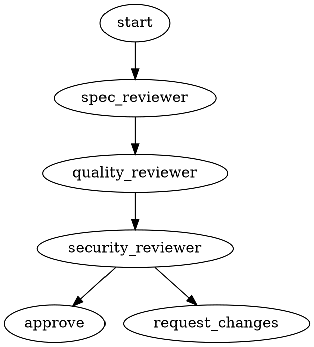

# 第3章 Sub-agent Control Blueprint — 打造聽話不燒錢的子代理

> Claude Code in Production | Yosuke Morikawa | Patterns 28–44

---

## 章節概覽

Sub-agents 是 Claude Code 的平行執行單元。本章核心：
**用正確的模型做正確的事，加上反欺騙設計，讓子代理便宜又可靠。**

---

## 核心模式

### Pattern 28–30：Sub-agents vs Agent Teams

| 面向 | Sub-agents | Agent Teams（實驗性）|
|------|-----------|---------------------|
| Sessions | 單主 session | 多個獨立 session |
| 通訊 | 只透過主代理 | 代理間直接溝通 |
| Token 成本 | 低（結果摘要回傳） | 高（多個實例同時跑）|
| 穩定性 | 正式功能 | 實驗性，/resume 不支援 |

**決策流程：**
```
任務可獨立執行？
 ├─ YES → Sub-agents 就夠了
 └─ NO → 需要代理互相討論？
            ├─ YES → 考慮 Agent Teams（實驗性）
            └─ NO → 主對話順序執行
```

**建議：優先用 Sub-agents，除非確實需要 agent-to-agent 溝通。**

---

### Pattern 31–35：模型選擇矩陣

| 任務類型 | 建議模型 | 理由 |
|---------|---------|------|
| 檔案探索 / 搜尋 | haiku | 速度優先，成本極低 |
| 程式碼審查（格式） | haiku | Pattern matching 為主 |
| Bug 修復 / 實作 | sonnet | 能力與成本平衡 |
| 安全性稽核 | sonnet | 需要高準確率 |
| 架構設計 | sonnet/opus | 複雜推理 |
| 大規模重構 | inherit | 跟主對話設定一致 |

```yaml
# 設定全部子代理用 Haiku
---
name: file-explorer
model: haiku
tools: Read, Grep, Glob
---

# 或全域設定
export CLAUDE_CODE_SUBAGENT_MODEL=haiku
```

**實務原則：探索類 → haiku，修改類 → sonnet，不確定 → inherit。**

---

### Pattern 36–39：專門化 Reviewer 代理

#### code-quality-reviewer
```yaml
---
name: code-quality-reviewer
description: >
  Verify code quality, maintainability, and security.
  Use after spec-compliance-reviewer.
tools: Read, Grep, Glob
model: inherit
---
檢查清單：
1. 函式/變數命名清晰度
2. 重複程式碼
3. 錯誤處理完整性
4. 硬編碼 credentials
5. 測試覆蓋率

回報格式：Critical / Warning / Suggestion
```

#### 串聯 Reviewer 流程
```
spec-compliance-reviewer → code-quality-reviewer → security-reviewer → api-reviewer
```

每個 reviewer 只做一件事，Context 乾淨，結果更準確。

---

### Pattern 40–42：決策矩陣 + 防理由化

#### 決策矩陣（`decision-matrix.md`）

```
1. 主對話執行  — 需要使用者互動、結果影響後續選擇
2. Sub-agents — 可獨立、只回傳結果
3. Agent Teams — 需要代理間溝通（慎用）
```

#### 反「理由化行為」（Rationalization Prevention）

AI 遇到困難任務時的常見逃跑藉口對照表：

| 理由化說法 | 真實意思 | 正確應對 |
|-----------|---------|---------|
| 「檔案太大」 | 懶得讀 | 用 Read 只讀需要的範圍 |
| 「需要超出範圍的改動」 | 想逃避 | 先執行指示範圍，再列額外工作 |
| 「品質可能下降」 | 不想照指示做 | 照指示執行，結尾報告品質疑慮 |
| 「發生錯誤了」 | 想停止 | 分析錯誤，嘗試解法，再回報 |
| 「格式不清楚」 | 想拖延 | 用最合理的解讀推進，說明假設 |

**AGENT.md 加入此表 → AI 無法用這些理由停工。**

---

### Pattern 43–44：代理工作流設計

#### code-review.dot（視覺化工作流）



#### test-scenarios.md（測試情境文件）

為每個代理角色定義測試情境，確保 agent 行為可預測：
- 正常路徑（happy path）
- 邊界案例（edge cases）
- 失敗情境（failure modes）

---

## 如何套用到我的工作流

| 需求 | Sub-agent 設計 |
|------|--------------|
| 程式碼快速掃描 | haiku explorer（Read/Grep only） |
| PR 審查 | sonnet reviewer（Read/Grep/Glob，無 Write） |
| 大量文件搜尋 | 多個 haiku 平行，主代理整合摘要 |
| 架構決策 | sonnet architect（討論用，不寫檔） |
| 我的 47 個 Skills | 分類：探索型 → haiku，實作型 → inherit |

**我現有的代理（小研/小核/小雲等）可以加 `model: haiku` 降成本。**

---

## 最值得馬上借鑑

1. **rationalization-prevention.md 內嵌到 AGENT.md**
   - 複製表格到 `~/.claude/instructions/agent-rules.md` 並 `@include`
   - 效果：代理碰到困難時不再說「太複雜了我做不到」

2. **model-cost-matrix.md 重新設定現有代理模型**
   - 探索型代理（小核查狀態、小雲查 log）→ 加 `model: haiku`
   - 估計節省 60-80% 探索類 token 成本

---

## Sample Code 位置

```
code/part3-agents/
├── agents/
│   ├── code-quality-reviewer.md    ← 品質審查代理
│   ├── security-reviewer.md        ← 安全審查代理
│   ├── spec-compliance-reviewer.md ← 規格合規審查
│   └── api-reviewer.md             ← API 設計審查
├── docs/
│   ├── decision-matrix.md          ← 何時用 Sub-agents/Teams
│   ├── model-cost-matrix.md        ← 模型選擇對照表
│   ├── rationalization-prevention.md ← 反理由化行為對照
│   └── builtin-agents-reference.md ← 內建代理參考
└── workflows/
    ├── code-review.dot             ← 審查工作流圖
    └── test-scenarios.md           ← 代理測試情境
```
